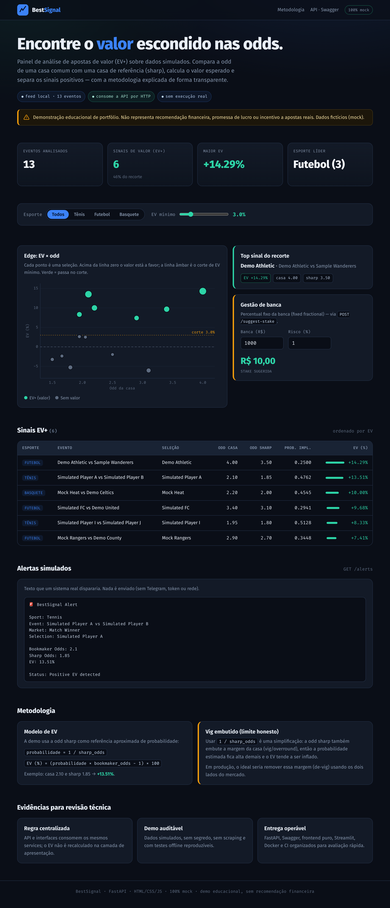

# BestSignal


BestSignal é um projeto de estudo que simula uma mesa simples de análise de
apostas de valor, ou EV+. A ideia foi pegar um domínio com regra de negócio
clara, tratar os dados com cuidado e entregar algo que desse para testar,
rodar localmente e explicar em uma entrevista técnica.

O app usa dados mockados de eventos esportivos e compara a odd de uma casa comum
com uma odd de referência, chamada aqui de sharp. A partir disso, calcula o valor
esperado da seleção e marca quais oportunidades passam de um corte mínimo de EV.

Tudo aqui é simulado. O projeto não faz scraping, não usa token real, não envia
alertas externos e não deve ser lido como recomendação financeira ou incentivo a
apostas reais.



## Por que construí

Eu queria um projeto que mostrasse mais do que uma tela bonita. O foco foi juntar
backend, frontend, dashboard e testes em volta da mesma regra de negócio, sem
duplicar cálculo em cada camada.

Alguns pontos que tentei deixar claros no código:

- a API só traduz HTTP para chamadas de serviço;
- os cálculos ficam em `app/services`;
- os dados são offline para a demo ser reproduzível;
- o frontend consome a API de verdade, usando `fetch`;
- o dashboard Streamlit reutiliza os mesmos services;
- os testes cobrem tanto a API quanto a regra de negócio.

## O que dá para fazer no projeto

- Ver uma lista de odds simuladas com EV calculado.
- Filtrar apenas os sinais acima de um EV mínimo.
- Calcular EV manualmente para um par de odds.
- Pré-visualizar mensagens de alerta, sem enviar nada de verdade.
- Calcular uma sugestão simples de stake por percentual da banca.
- Abrir a mesma base em uma interface web e em um dashboard Streamlit.

## Interfaces

### Web

A interface principal fica em `web/` e é servida pela própria aplicação FastAPI
em `/`. Ela tem KPIs, gráfico EV por odd, tabela de sinais, prévia de alerta e
um bloco explicando o modelo usado.

O frontend foi feito com HTML, CSS e JavaScript puro. Escolhi esse caminho para
manter a demo leve e mostrar o consumo da API sem esconder a lógica atrás de um
framework.

### Streamlit

Também deixei um dashboard em `dashboard.py`. Ele não chama a API por HTTP:
importa os services diretamente, aplica os filtros e monta as visualizações.


## Estrutura

```text
app/
├── api/                 # Rotas HTTP e schemas Pydantic
├── data/                # sample_odds.json com dados simulados
├── services/            # Cálculos e regras de negócio
├── config.py            # Configurações simples do projeto
├── main.py              # FastAPI + arquivos estáticos da interface web
└── models.py            # Modelos de domínio
docs/                    # Documentação e imagens
tests/                   # Testes automatizados
web/                     # HTML, CSS e JS
dashboard.py             # Dashboard Streamlit
Dockerfile
docker-compose.yml
requirements.txt
```

## API

| Método | Rota | O que faz |
| --- | --- | --- |
| `GET` | `/health` | Retorna o status básico da API |
| `GET` | `/odds` | Lista odds simuladas com EV calculado |
| `GET` | `/value-bets?min_ev=3.0` | Filtra sinais acima do EV mínimo |
| `POST` | `/calculate-ev` | Calcula EV para odds enviadas no body |
| `GET` | `/alerts` | Monta mensagens simuladas de alerta |
| `POST` | `/suggest-stake` | Sugere stake por percentual da banca |

## Como o EV é calculado

O cálculo usa a odd sharp como uma aproximação de probabilidade:

```text
probabilidade estimada = 1 / sharp_odds
EV (%) = (probabilidade estimada * bookmaker_odds - 1) * 100
```

Exemplo:

```text
bookmaker_odds = 2.10
sharp_odds = 1.85
EV = ((1 / 1.85) * 2.10 - 1) * 100 = 13.51%
```

Esse modelo é propositalmente simples. Em um produto real, eu não usaria a odd
sharp crua como probabilidade justa sem antes remover margem da casa. O próximo
passo seria trabalhar com os dois lados do mercado e aplicar de-vig antes de
calcular o EV.

## Stack

- Python 3.11+
- FastAPI
- Pydantic
- Uvicorn
- Streamlit
- Pandas
- Plotly
- Pytest
- HTML, CSS e JavaScript
- Docker Compose
- GitHub Actions

## Rodando localmente

```bash
python3 -m venv .venv
.venv/bin/python -m pip install --upgrade pip
.venv/bin/python -m pip install -r requirements.txt
```

Para subir a API e a interface web:

```bash
.venv/bin/uvicorn app.main:app --reload
```

Links locais:

- Interface web: `http://127.0.0.1:8000/`
- Swagger: `http://127.0.0.1:8000/docs`
- Health check: `http://127.0.0.1:8000/health`

Para abrir o dashboard:

```bash
.venv/bin/streamlit run dashboard.py
```

## Exemplos rápidos

```bash
curl http://127.0.0.1:8000/health
```

```bash
curl "http://127.0.0.1:8000/value-bets?min_ev=3.0"
```

```bash
curl -X POST http://127.0.0.1:8000/calculate-ev \
  -H "Content-Type: application/json" \
  -d '{"bookmaker_odds":2.10,"sharp_odds":1.85}'
```

Resposta:

```json
{
  "bookmaker_odds": 2.1,
  "sharp_odds": 1.85,
  "implied_probability": 0.4762,
  "ev_percent": 13.51,
  "is_value_bet": true
}
```

## Testes

```bash
.venv/bin/python -m pytest -q
```

A suíte cobre os cálculos de EV, validações de odds, filtro de value bets,
endpoints da API, alertas simulados e sugestão de stake.

## Docker

```bash
docker compose up --build
```

Depois é só acessar:

- API e interface web: `http://localhost:8000`
- Swagger: `http://localhost:8000/docs`

## O que eu melhoraria depois

- Implementar de-vig usando mercados completos.
- Salvar histórico local dos sinais calculados.
- Criar conectores mockáveis para fontes externas.
- Adicionar autenticação se algum endpoint passasse a lidar com dado sensível.
- Melhorar a análise por esporte, mercado e faixa de EV.
