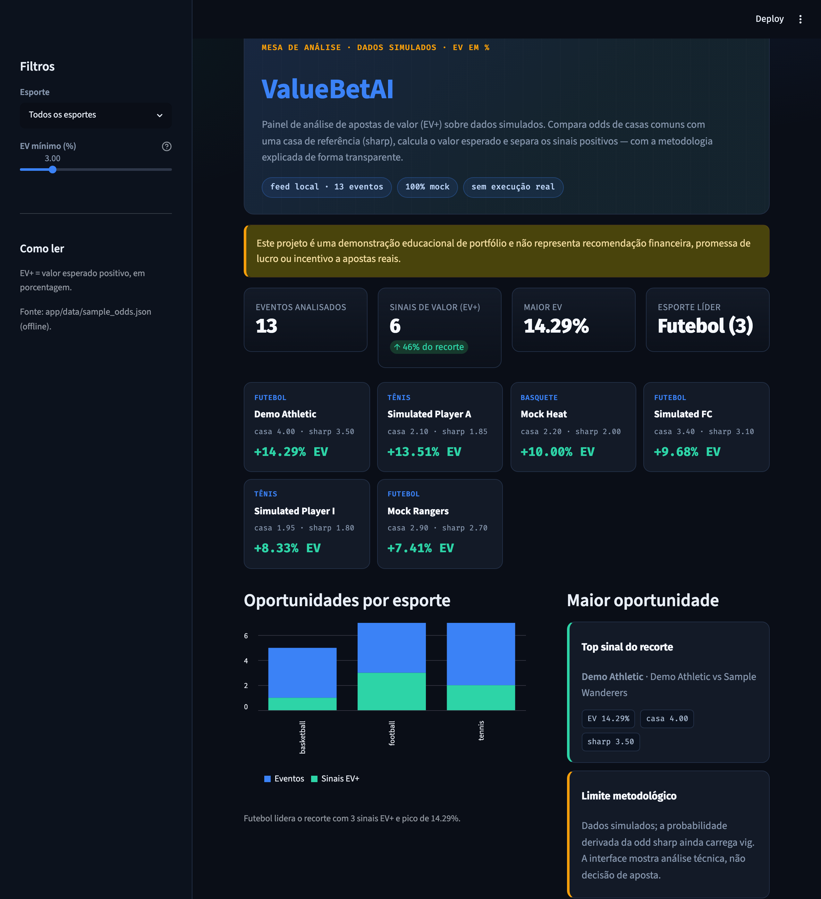

# ValueBet AI — Demo de Portfólio

<!-- Troque OWNER/REPO pelo seu usuário e repositório no GitHub para o badge funcionar. -->


Detector de **apostas de valor (EV+)** multi-esportes (tênis, futebol, basquete),
construído com **FastAPI** + um dashboard em JavaScript puro.

> ⚠️ **Aviso.** Projeto **educacional / de portfólio**. EV positivo é uma medida
> estatística de longo prazo — **não promete lucro nem garante acerto**. Os dados
> são **fictícios (mock)**: a aplicação **não usa nenhuma API externa, chave ou
> serviço pago, e roda 100% offline**.



---

## O que é uma "value bet"?

Toda odd de uma casa de apostas carrega uma **probabilidade implícita** (`1 / odd`).
Se a **nossa estimativa** de probabilidade for *maior* do que essa implícita,
existe uma vantagem matemática a nosso favor — o **valor esperado (EV)** fica
positivo. Esse é o sinal que o projeto detecta e ranqueia.

| Conceito | Fórmula | Exemplo (prob 55%, odd 2.00) |
|----------|---------|------------------------------|
| Prob. implícita | `1 / odd` | `0.50` (50%) |
| Edge (vantagem) | `prob − implícita` | `+0.05` (+5%) |
| Valor esperado (EV) | `prob × odd − 1` | `+0.10` (+10%) |
| Fração de Kelly | `EV / (odd − 1)` | `0.10` (10% da banca) |

A regra de ouro: **há valor quando `EV > 0`** (ou seja, quando achamos o evento
mais provável do que a odd sugere).

---

## Como rodar

Pré-requisito: **Python 3.11+** (testado em 3.14).

```bash
# 1. clonar e entrar na pasta
git clone <url-do-repo> valuebet-ai-portfolio-demo
cd valuebet-ai-portfolio-demo

# 2. criar o ambiente virtual e instalar as dependências
python3 -m venv .venv
.venv/bin/pip install -r requirements.txt

# 3. subir a aplicação
.venv/bin/uvicorn app.main:app --reload
```

Depois abra no navegador:

- **Dashboard:** http://127.0.0.1:8000
- **Documentação interativa da API (Swagger):** http://127.0.0.1:8000/docs

Nenhuma chave de API ou configuração é necessária — a demo já vem com dados mock.

---

## Endpoints da API

| Método | Rota | Descrição |
|--------|------|-----------|
| `GET` | `/api/health` | Checagem de saúde |
| `GET` | `/api/matches` | Jogos crus (dados de entrada) |
| `GET` | `/api/value-bets` | Value bets calculadas e ranqueadas por EV |

O `/api/value-bets` aceita filtros via query string:

| Parâmetro | Padrão | Exemplo |
|-----------|--------|---------|
| `min_ev` | `0.03` | `?min_ev=0.05` (só EV ≥ 5%) |
| `min_odds` | `1.30` | `?min_odds=1.50` |
| `max_odds` | `6.00` | `?max_odds=4.00` |
| `sport` | — | `?sport=tennis` |

Exemplo:

```bash
curl "http://127.0.0.1:8000/api/value-bets?sport=tennis&min_ev=0.05"
```

---

## Arquitetura

O projeto é dividido em **camadas** — cada uma com uma responsabilidade só, o que
torna a lógica testável sem subir servidor. Detalhes em
[`docs/ARCHITECTURE.md`](docs/ARCHITECTURE.md).

```
app/
├── core/value.py            # matemática pura (EV, edge, Kelly) — sem dependências
├── models/schemas.py        # modelos de dados (Pydantic)
├── data/mock.py             # fonte de dados (mock determinístico)
├── services/value_service.py# regras de negócio: filtra e ranqueia
└── main.py                  # API FastAPI (camada fina) + serve o dashboard
web/
└── index.html               # dashboard (HTML + CSS + JS puro, sem build)
tests/                       # 30 testes (núcleo, serviço, API)
```

Fluxo de uma requisição:

```
navegador → /api/value-bets → value_service → core/value + data/mock → JSON → dashboard
```

---

## Testes

```bash
.venv/bin/python -m pytest -q
```

São **30 testes** cobrindo a matemática, o serviço de ranqueamento e a API.

---

## Decisões de design

- **Sem framework no front, sem build.** O dashboard é HTML/CSS/JS puro servido
  pelo próprio FastAPI. `clone → install → run` e está no ar.
- **Núcleo isolado.** `core/value.py` não importa nada do projeto; é matemática
  pura e fácil de testar.
- **Troca de fonte de dados num ponto só.** Toda a aplicação consome
  `mock.get_matches()`. A demo é mock por design e não depende de serviços externos.
- **Postura responsável.** Nenhuma promessa de lucro. A explicação de cada sinal
  reforça que EV+ é estatística, não garantia.
- **Dependências mínimas.** FastAPI, Uvicorn, Pydantic, Pytest. Nada além.

---

## Licença

Uso educacional / portfólio.
